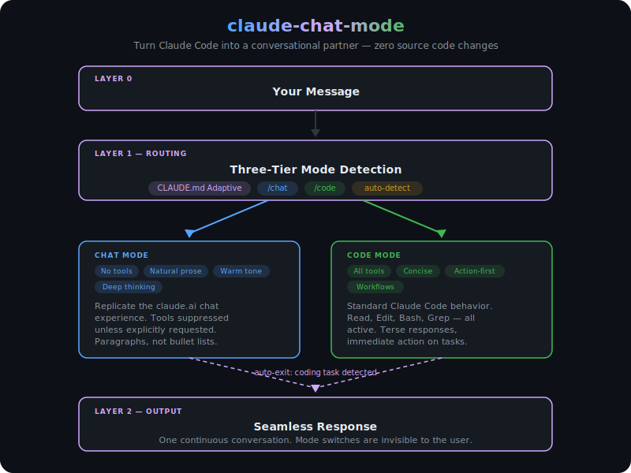

# claude-chat-mode

Turn [Claude Code](https://docs.anthropic.com/en/docs/claude-code) into a warm, thoughtful conversational partner — with a single slash command.

Claude Code is incredible for coding, but its default personality is terse and tool-happy. When you want to have a real conversation — discuss ideas, analyze a paper, brainstorm research directions — it keeps trying to `Read` files and `Bash` commands instead of just *thinking*.

This project adds two slash commands (`/chat` and `/code`) that let you seamlessly switch between conversational and coding modes within the same session. No source code modifications, no ToS violations — pure configuration.

## Motivation

Here's a riddle that convinced me this matters:

> A girl scores 38 on a math test. Terrified of her father's punishment, she secretly changes the 3 to an 8, making it 88. Her father sees the test paper, slaps her, and yells: *"Why is half of this 8 green and the other half red? Do you think I'm an idiot?"* The girl cries but says nothing. A few minutes later, the father suddenly breaks down. **Why?**

The answer involves X-linked recessive inheritance of red-green color blindness — the girl wasn't being careless with pen colors; she literally cannot distinguish red from green. But for a daughter to be color-blind, her biological father must also carry the gene. This father can clearly see colors. So the girl is not his biological daughter.

**In default code mode, Claude Code almost never solves this** — it pattern-matches to "a trick question" and rushes to a shallow answer. In `/chat` mode, it reasons through the genetics step by step and nails it. The mode switch isn't cosmetic; it unlocks genuinely deeper reasoning by suppressing the tool-first, action-first reflex.

## Architecture

<p align="center">
  
</p>

## How It Works

Three layers work together:

1. **CLAUDE.md Adaptive Mode** — auto-detects whether your message is a conversation or a coding task, and adjusts behavior accordingly. Works ~80% of the time.

2. **`/chat` command** — explicit override for when auto-detection isn't enough. Switches Claude to conversational mode: natural prose, deep thinking, no reflexive tool usage.

3. **`/code` command** — switches back to full coding assistant mode with all tools active.

Chat mode includes **auto-exit**: if you send a clearly coding-related message (e.g., "fix this bug"), Claude silently switches back to code mode without needing `/code`.

Open `diagram.html` in a browser to see the architecture diagram.

## Install

```bash
git clone https://github.com/dopawei/claude-chat-mode.git
cd claude-chat-mode
bash install.sh
```

Or manually copy the files:

```bash
cp commands/chat.md ~/.claude/commands/chat.md
cp commands/code.md ~/.claude/commands/code.md
```

Optionally, add the adaptive mode section to your `~/.claude/CLAUDE.md` (see `CLAUDE.md.example`).

## Usage

```
/chat                          # switch to conversational mode
/chat explain attention to me  # chat mode with an initial message
/code                          # switch back to coding mode
/code fix the bug in utils.py  # code mode with an immediate task
```

In chat mode, Claude will:
- Respond in natural paragraphs, not bullet lists
- Think deeply and give thorough, nuanced answers
- Avoid using tools unless you explicitly ask
- Use a warm, natural tone (like claude.ai)
- Auto-exit back to code mode if you send a coding task

## What This Is NOT

- **Not "dumber" mode** — Claude thinks *more* deeply in chat mode, not less
- **Not "refuse tools" mode** — if you explicitly ask Claude to read a file, it will
- **Not a source code hack** — everything uses official Claude Code configuration

## File Structure

```
~/.claude/
  CLAUDE.md              ← adaptive mode auto-detection (optional)
  commands/
    chat.md              ← /chat slash command
    code.md              ← /code slash command
```

## License

MIT
